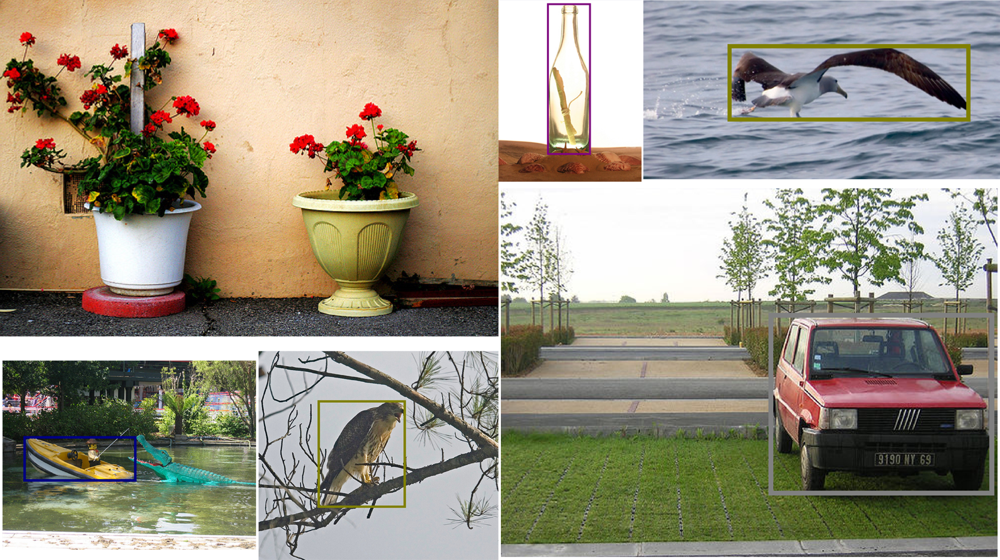
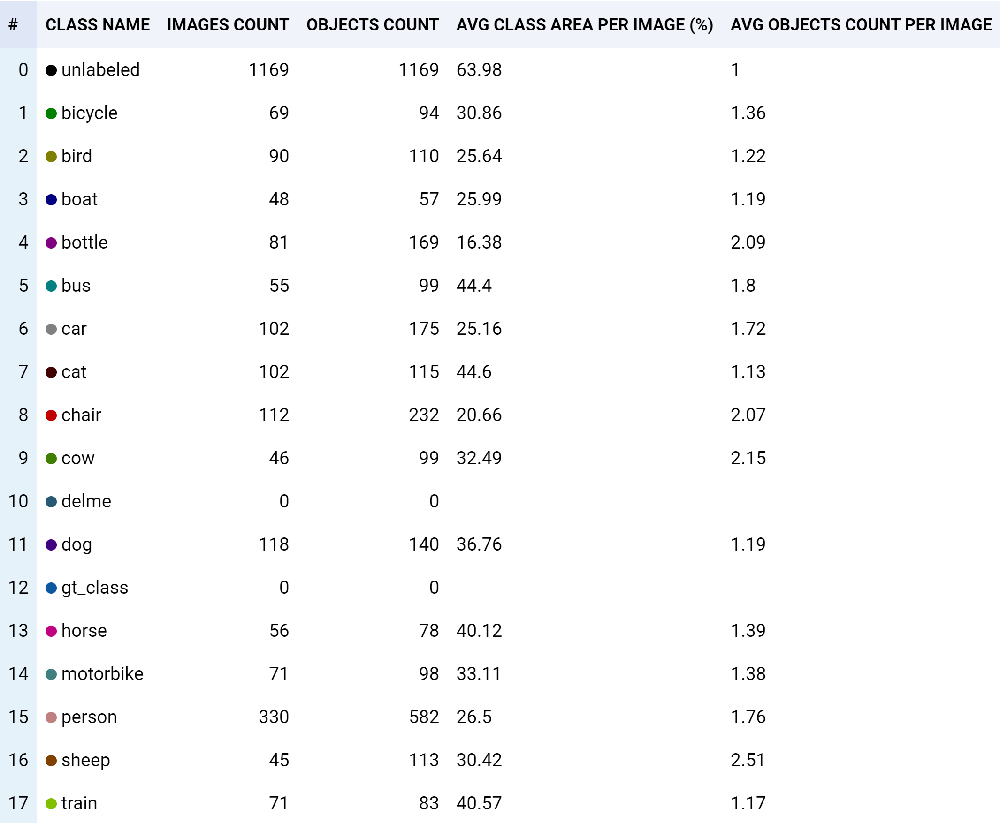
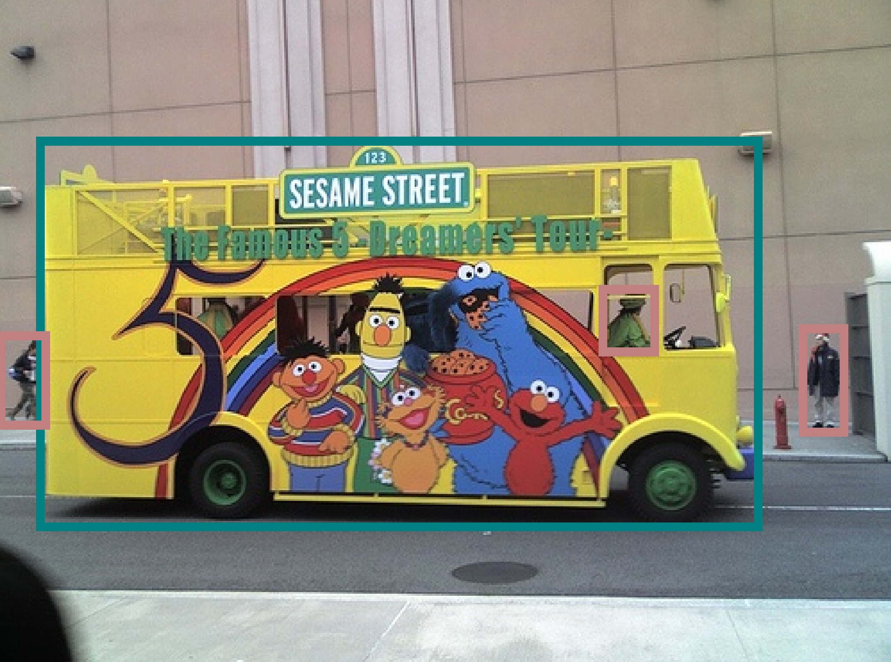

 

  

 

# PascalVOC Ground Truth BBoxes (Sample)

  <a href="#overview">Overview</a> •
  <a href="#download">Download</a> •
  <a href="#statistics">Statistics</a> •
  <a href="#examples">Examples</a>

 

## Overview 

 `pascal_sample_gt` is a sample project with the total of 1171 images from PascalVOC `train`, `val` (and mixed `trainval`) subsets. 

## Download

Direct download: [tar archive](https://cloud.enterprise.deepsystems.io/s/gKL8sHhWkAsQ1z7/download) (130,6 MB).

## Statistics

Project contains 3 datasets with 1171 images in it, with a total of 2244 annotated objects. 

## Examples

  
